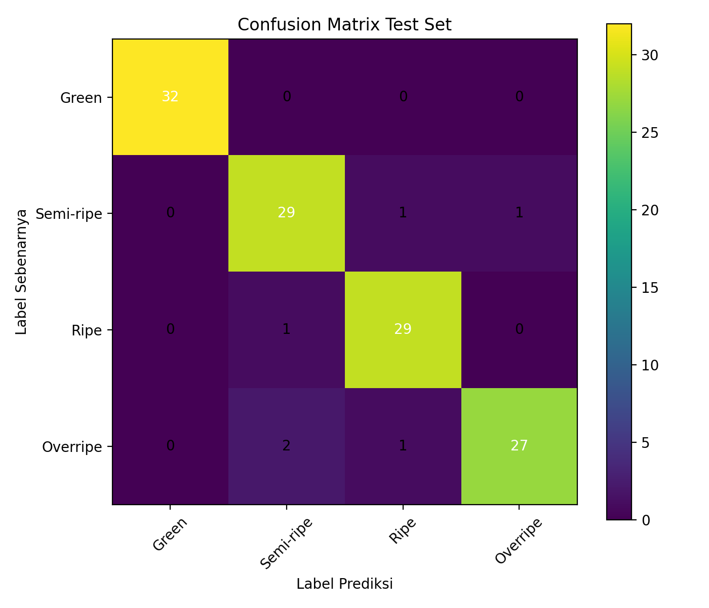
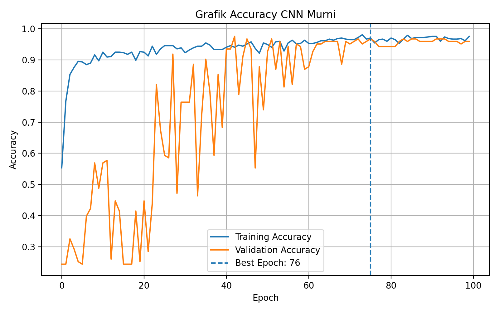
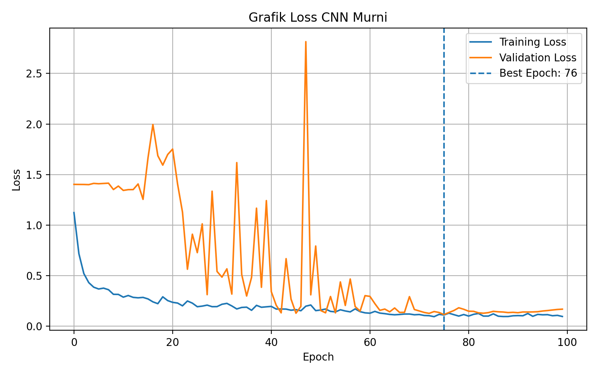
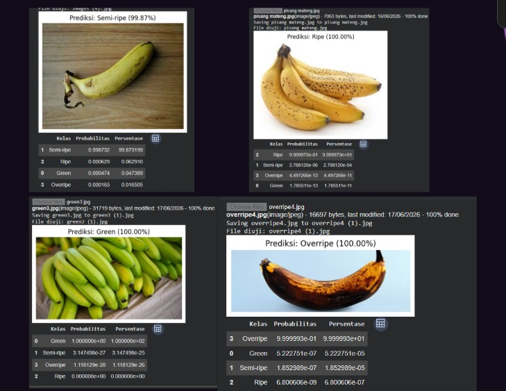

# Banana Ripeness Classification Using CNN

## Author

Muhammad Hanif Hibatulloh  

Computer Science Student  
Universitas Jenderal Achmad Yani  

---

## Overview

This project implements a Convolutional Neural Network (CNN) based image classification model to identify banana ripeness levels using digital images.

The objective of this project is to develop an image classification system capable of recognizing different maturity stages of bananas using deep learning approaches.

---

## Classification Classes

The model classifies banana images into four categories:

- Green
- Semi-ripe
- Ripe
- Overripe

---

## Methodology

The project workflow consists of:

1. Dataset preparation
2. Image preprocessing
3. CNN model development
4. Model training
5. Model evaluation

---

## Model Architecture

The classification model uses a Convolutional Neural Network (CNN) architecture consisting of:

- Convolutional Layers
- Activation Function
- Pooling Layers
- Feature Extraction
- Fully Connected Layers
- Softmax Classification

---

## Performance

The model achieved:

- Test Accuracy: **95.12%**

---

## Results Visualization

### Confusion Matrix



### Training Accuracy



### Training Loss



### Prediction Example



---

## Technologies

- Python
- TensorFlow
- Keras
- NumPy
- OpenCV
- Matplotlib
- Scikit-learn

---

## Project Structure

```text
banana-ripeness-classification-cnn/

├── banana_ripeness_classification.ipynb
├── results/
│   ├── confusion_matrix_test.png
│   ├── grafik_accuracy.png
│   ├── grafik_loss.png
│   └── prediction_example.jpeg
├── requirements.txt
└── README.md
